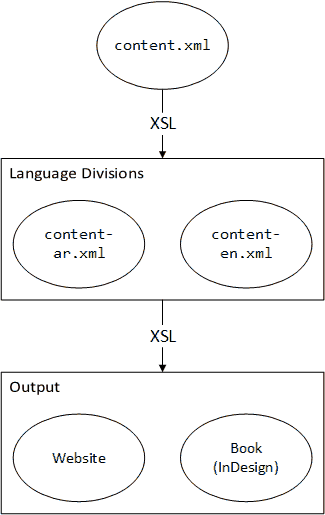

# Ṣaḥīḥ al-Adhkār

Ṣaḥīḥ al-Adhkār is about creating standardized files for the book _Ṣaḥīḥ al-Adhkār_ by Shaykh al-Albānī (May Allāh have mercy on him).

## Proposed Plan

## To Do

- How to manage the Propohet's salution symbol, i.e. (ﷺ). Each output format deals with it differently.
- How to manage the colors of narrators, the supplication, and repitition in the XML.
- (Take for example the first dua,) Should each line be represented as a paragraph? If not, how do line breaks work in XML?

# License

All files under the `references` folder are rights of their respective creators and are uploaded for convenience.